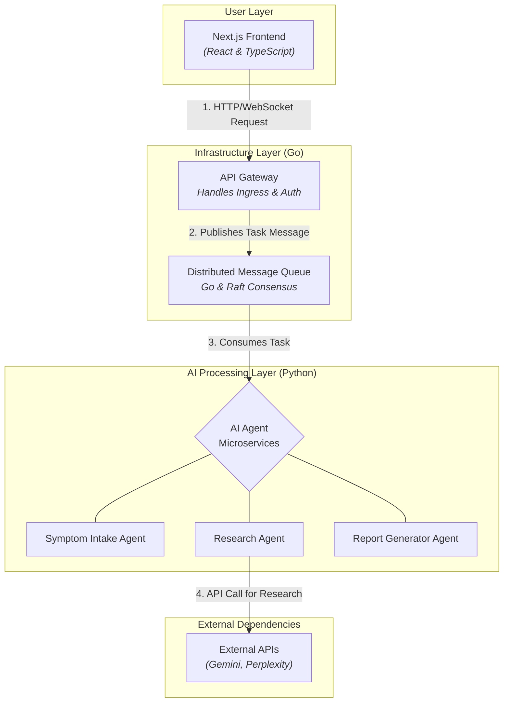

# MedLama: A Scalable, AI-Powered Medical Diagnostics Platform

<p align="center">
  
  
  
  
  
  
</p>

## 🚀 Project Vision

**MedLama** is an advanced AI platform designed to simulate preliminary medical diagnostic consultations. This project aims to provide accessible, preliminary medical information while serving as a robust case study in designing scalable, AI-driven distributed systems.

The core of the system is a sophisticated AI agent, built with **LangGraph**, that achieved **92% diagnostic accuracy** against a medical expert's evaluation. Originally a full-stack application, the project is currently being re-architected into a **resilient, distributed system** capable of handling high-concurrency workloads using Go and Kubernetes.

---

## 📋 Table of Contents
* [Key Features](#-key-features)
* [Target Architecture](#️-target-architecture)
* [Engineering Challenges & Solutions](#-engineering-challenges--solutions)
* [Project Roadmap](#-project-roadmap)
* [Technology Stack & Rationale](#️-technology-stack--rationale)
* [Running the Prototype](#-running-the-prototype)
* [Contributing](#-contributing)

---

## ✨ Key Features

* **Proven Diagnostic Accuracy:** The core AI agent has been benchmarked at **92% accuracy** against a medical expert on a complex disease case, demonstrating its effectiveness.
* **Scalable Microservices Architecture:** The system is built using **Go** microservices, allowing for independent scaling of components like API handling and AI processing to meet demand efficiently.
* **Fault-Tolerant by Design:** The system's backbone is a high-throughput message queue leveraging the **Raft consensus algorithm**. This allows the system to withstand the failure of individual server nodes without data loss or service interruption.
* **Asynchronous Processing:** The message queue decouples the client-facing services from the backend AI agents, allowing for long-running diagnostic tasks to be processed in the background without blocking the user interface.
* **Advanced Agentic Workflow:** The AI agent uses **LangGraph** to manage a robust, multi-step conversational state, allowing it to reason, use external tools autonomously, and handle complex conversational flows.
* **Modern Frontend:** A responsive and interactive user interface built with **Next.js** and **TypeScript** for a seamless user experience.

## 🏗️ Target Architecture

The new architecture is designed for scalability and resilience. The monolithic backend is being decomposed into a set of independent, communicating microservices.


### Service Responsibilities:

  * **API Gateway (Go):** A single, high-performance entry point for all client traffic. It is responsible for routing requests to the appropriate internal services, handling SSL termination, and implementing security measures like authentication and rate limiting.
  * **Distributed Message Queue (Go & Raft):** The asynchronous backbone of the system. It persists user requests and tasks, guaranteeing message delivery even if consuming services are temporarily unavailable. Its use of the Raft consensus algorithm ensures data is replicated across multiple nodes for high availability.
  * **AI Agent Services (Python):** The core agent logic is broken into smaller, specialized microservices (e.g., `symptom-intake`, `research-agent`, `report-generator`). Each service is a consumer of the message queue, allowing them to be scaled independently based on their specific workload.

## 🧠 Engineering Challenges & Solutions

Building a distributed AI system presents unique challenges. Here’s how this architecture addresses them:

  * **Challenge: Maintaining Conversation State**

      * **Problem:** In a stateless, distributed environment, how do you track a multi-turn conversation across potentially many replicas of the AI services?
      * **Solution:** Conversational state and session data are passed as part of the messages in the queue. This decouples state from the services themselves, allowing any available `AI Agent Service` to process the next step in a conversation.

  * **Challenge: Ensuring Low-Latency Interaction**

      * **Problem:** AI models can have high inference latency. How do we provide a responsive user experience without making the user wait for long-running processes?
      * **Solution:** The system uses an asynchronous, message-based architecture. The API Gateway immediately acknowledges a user's request and sends it to the message queue. The frontend can then use WebSockets or polling to receive the AI's response once the background processing is complete.

  * **Challenge: Service Discovery & Load Balancing**

      * **Problem:** How do services find and communicate with each other in an environment where instances are constantly being created and destroyed?
      * **Solution:** The entire system is designed to be deployed on **Kubernetes**, which provides built-in DNS-based service discovery and load balancing, abstracting away the complexity of inter-service communication.

## 🗺️ Project Roadmap

This project is being developed in planned phases. The source code for the new Go-based services will be hosted in a separate repository upon completion of Phase 1.

  * **Phase 1: Distributed Message Queue Core (In Progress - Est. Q3 2025)**

      * [ ] Build the core message queue in Go with a gRPC API.
      * [ ] Integrate the Raft consensus algorithm via `hashicorp/raft`.
      * [ ] Containerize the service with Docker.
      * **Goal:** Create the fault-tolerant, distributed backbone for the system.

  * **Phase 2: AI Agent Integration (Planned Q4 2025)**

      * [ ] Adapt the existing Python AI agents to communicate via the message queue.
      * [ ] Implement producer/consumer logic for asynchronous task handling.
      * **Goal:** Decouple the AI logic into independent, scalable microservices.

  * **Phase 3: Kubernetes Deployment (Planned Q1 2026)**

      * [ ] Write Kubernetes manifests for all services.
      * [ ] Deploy the full application to a cloud-based Kubernetes cluster.
      * **Goal:** Demonstrate operational readiness and automated orchestration.

## 🛠️ Technology Stack & Rationale

A polyglot approach was chosen to use the best tool for each specific job.

| Category                      | Technology                                | Rationale                                                                        |
| ----------------------------- | ----------------------------------------- | -------------------------------------------------------------------------------- |
| **Backend Systems** | Go, gRPC, Raft Consensus                  | **Go** was chosen for its high performance, excellent concurrency model, and low memory footprint, making it ideal for network services like gateways and message queues. |
| **AI & Application Logic** | Python, LangGraph, LangChain, Gemini      | **Python** offers an unparalleled ecosystem for AI/ML development. **LangGraph** provides the framework for building complex, stateful AI agents. |
| **Containerization & Orchestration** | Docker, Kubernetes               | **Docker** provides containerization for predictable deployments. **Kubernetes** is the industry standard for orchestrating, scaling, and managing containerized applications. |
| **Frontend & Database** | Next.js, React, TypeScript, MongoDB       | **Next.js** and **TypeScript** enable the creation of a modern, type-safe, and performant user interface. **MongoDB** provides a flexible document store for conversation history. |

## ⚙️ Running the Prototype

The original, monolithic version of MedLama (which includes the 92% accurate AI agent) can be run locally.

### Prerequisites

  * Node.js and npm
  * Python 3.10+ and pip
  * `GEMINI_API_KEY` from Google AI Studio
  * `PERPLEXITY_API_KEY` from Perplexity AI

### Backend Setup

1.  **Clone the repository:**
    ```bash
    git clone [https://github.com/SakshamKapoor2911/Full_stack_Medical_Diagnostics.git](https://github.com/SakshamKapoor2911/Full_stack_Medical_Diagnostics.git)
    cd Full_stack_Medical_Diagnostics
    ```
2.  **Set up a Python virtual environment:**
    ```bash
    python -m venv venv
    source venv/bin/activate  # On Windows, use `venv\Scripts\activate`
    ```
3.  **Install Python dependencies:**
    ```bash
    pip install -r requirements.txt
    ```
4.  **Set up environment variables:** Create a `.env` file in the root directory and add your API keys:
    ```
    GEMINI_API_KEY="YOUR_GEMINI_API_KEY"
    PERPLEXITY_API_KEY="YOUR_PERPLEXITY_API_KEY"
    ```
5.  **Run the backend server:** (Assuming your entry point is `app.py`)
    ```bash
    python app.py
    ```

### Frontend Setup

1.  **Navigate to the frontend directory:**
    ```bash
    cd medLama
    ```
2.  **Install npm dependencies:**
    ```bash
    npm install
    ```
3.  **Run the frontend development server:**
    ```bash
    npm run dev
    ```
4.  Open your browser and navigate to `http://localhost:3000` to see the application running.
