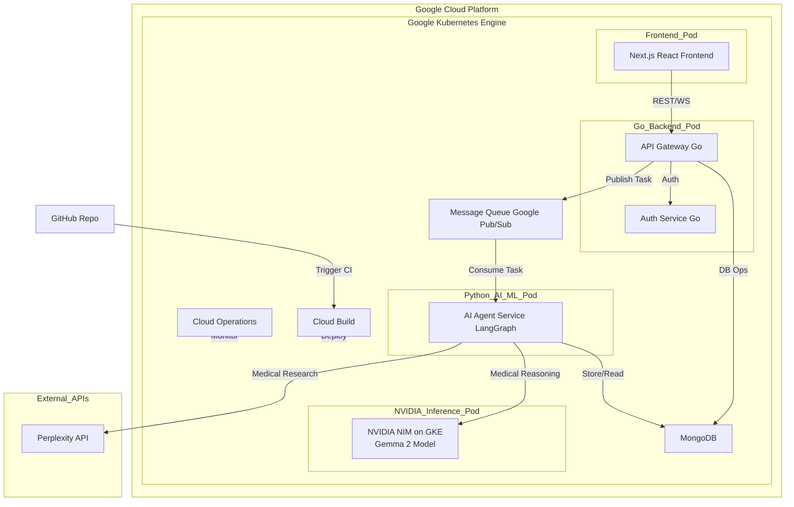

# MedLama - AI-Powered Medical Diagnostics Platform

<p align="center">
  
  
    
    
  
  
  
  
  
  
</p>

**Target Company:** Google Health

## 📋 Table of Contents
* [Core Concept](#-core-concept)
* [System Architecture](#️-system-architecture)
* [Key Features](#-key-features)
* [Technology Stack](#-technology-stack)
* [Engineering Challenges](#-engineering-challenges--solutions)
* [Prerequisites](#-prerequisites)
* [Getting Started](#️-getting-started)
* [Running Tests](#-running-tests)
* [Industry-Aligned Features](#-industry-aligned-features)


## 🌟 Core Concept

MedLama is a cloud-native, microservices-based platform for preliminary medical diagnostics. It combines:
- A high-performance Go backend for API gateway, message queue, and infrastructure
- A Python AI/ML microservice using LangGraph for advanced medical reasoning with self-hosted LLM inference
- A modern Next.js (React) frontend for a structured, scalable user experience
- **Self-hosted AI inference on GKE using NVIDIA NIM with Gemma 2 for privacy, performance, and cost control**
- External research capabilities via Perplexity API for accessing current medical literature

This architecture enables independent team development, robust scalability, and clear separation of concerns. The system is designed for reliability, extensibility, and real-world healthcare impact while keeping sensitive medical data within our own cloud environment.

## 🏗️ System Architecture




## 🗂️ Project Folder Layout

The project is organized as three main microservices, each in its own directory for clear separation of concerns and team independence:

```
Full_stack_Medical_Diagnostics/
├── services/
│   ├── backend-service/      # Go backend: API gateway, Google Pub/Sub messaging, auth, DB ops
│   ├── ai-service/           # Python AI/ML: LangGraph agents, LLM integration, research
│   └── medLama/              # Next.js frontend: UI, components, services, API integration
├── deployment/               # Docker Compose, Kubernetes manifests, CI/CD (GKE manifests, NIM deployment)
├── scripts/                  # Utility scripts
└── README.md
```

**Benefits of this layout:**
- Enables Go, Python, and Frontend teams to work independently and in parallel
- Makes it easy to isolate, debug, and deploy each service separately
- Supports scalable, modular development and clear code ownership
- Simplifies onboarding for new contributors by clarifying service boundaries
- Facilitates containerization and cloud-native deployment on GKE

---

## 📦 Key Features
- [ ] AI-powered symptom triage and diagnostic reasoning
- [ ] Multi-turn, context-aware conversation state
- [ ] Real-time notifications and alerts
- [ ] Secure user authentication and data privacy
- [ ] Modern, structured frontend (Next.js, React, TypeScript)
- [ ] Efficient storage and retrieval of medical conversations
- [ ] Modular microservices for scalability
- [ ] **Self-hosted, GPU-accelerated AI inference via NVIDIA NIM on GKE**

## ☁️ Technology Stack
| Category      | Technology                                 | Rationale                                                                 |
|--------------|--------------------------------------------|--------------------------------------------------------------------------|
| Backend Infrastructure | Go, gRPC, Docker                        | High-performance API gateway and microservice chassis                   |
| Messaging             | Google Pub/Sub                           | Reliable, scalable, and managed message queue for service decoupling    |
| AI/ML Service         | Python, FastAPI/Flask, LangGraph, LangChain | Advanced medical reasoning, stateful workflows, LLM integration         |
| AI Inference          | NVIDIA NIM, Gemma 2, GKE, NVIDIA GPUs, TensorRT | Low-latency, high-throughput, self-hosted Google LLM serving for data privacy |
| External Research     | Perplexity API                           | Real-time medical literature research and evidence gathering             |
| Frontend              | Next.js, React, TypeScript, Tailwind CSS  | Modern, scalable, and maintainable UI with SSR and fast dev experience      |
| Database              | MongoDB                                   | Flexible document store for conversation history                        |
| Real-time             | WebSockets                                | Live chat and notifications                                             |
| Container             | Docker                                    | Consistent, portable deployments                                        |
| Orchestration         | Google Kubernetes Engine (GKE)            | Scalability, resilience, and management of GPU-powered microservices    |
| CI/CD                 | Cloud Build, GitHub Actions               | Automated builds, tests, and deployments                                |
| Monitoring            | Google Cloud Operations, Prometheus, Grafana | Health checks, dashboards, and alerting                                 |
| Testing               | Pytest, Jest/Karma, Cypress               | Comprehensive backend and frontend testing                              |

## 🧠 Engineering Challenges & Solutions

### Challenge 1: Real-time, Multi-turn Conversation State
**Problem:** Maintaining context and accuracy across complex, multi-step medical dialogues.
**Solution:** Use LangGraph to manage robust conversational state and enable tool-using agent workflows.

### Challenge 2: Scalable & Decoupled Microservices
**Problem:** Ensuring the system can handle load and that services can be developed and deployed independently.
**Solution:** A Go-based API gateway communicates with the Python AI service asynchronously via a managed message queue (Google Pub/Sub), creating a resilient and scalable architecture.

### Challenge 3: High-Performance, Private AI Inference
**Problem:** Achieving low-latency responses for a real-time diagnostic tool while ensuring patient data remains private.
**Solution:** Deploy a pre-trained model as an NVIDIA NIM on a GPU-enabled GKE cluster. This leverages an optimized inference stack for performance and keeps all sensitive data within our own cloud environment.

### Challenge 4: Cloud-Native CI/CD and Monitoring
**Problem:** Ensuring reliable deployments and system health in production.
**Solution:** Use Google Cloud Build for CI/CD and Google Cloud Operations for monitoring, alerting, and dashboards.

## 📋 Prerequisites

- Go 1.22+
- Python 3.10+
- Node.js 18+ (with Angular CLI)
- MongoDB (local or Atlas)
- Google Cloud account with GKE, Cloud Build, and Cloud Operations enabled
- NVIDIA GPU quota in GCP for NIM deployment
- `PERPLEXITY_API_KEY` (for medical literature research)

## 🛠️ Getting Started


### Go Backend Setup
1. Navigate to the Go backend service:
    ```bash
    cd services/backend-service
    ```
2. Install dependencies:
    ```bash
    go mod tidy
    ```
3. Build and run the Go backend:
    ```bash
    go run ./cmd/main.go
    ```

### Python AI/ML Service Setup
1. Navigate to the Python AI/ML service:
    ```bash
    cd services/ai-service
    ```
2. Set up a Python virtual environment:
    ```bash
    python -m venv venv
    source venv/bin/activate  # On Windows: venv\Scripts\activate
    ```
3. Install Python dependencies:
    ```bash
    pip install -r requirements.txt
    ```
4. Set up environment variables:
    - Create a `.env` file in the ai-service directory and add your API keys.
5. Run the AI/ML service:
    ```bash
    python -m api.main
    ```

### Frontend Setup
1. Navigate to the frontend directory:
    ```bash
    cd services/frontend
    ```
2. Install dependencies:
    ```bash
    npm install
    ```
3. Run the frontend development server:
    ```bash
    ng serve
    ```


## 🧪 Running Tests

- **Go Backend Tests:**
    ```bash
    cd services/backend-service
    go test ./...
    ```
- **Python AI/ML Service Tests:**
    ```bash
    cd services/ai-service
    pytest
    ```
- **Frontend Tests:**
    ```bash
    cd services/frontend
    ng test
    ```


MedLama is built with strict test-driven development (TDD) principles:

- **Unit, integration, and end-to-end tests are required at every major phase.**
- **Test gates:** No phase is considered complete until all new features pass their respective tests.
- **Performance and accuracy:** AI/ML components are validated with benchmarks and truthfulness checks to ensure reliable medical reasoning.
- **Continuous integration:** Automated test runners (Go, Pytest, Karma/Jest, Cypress) are used before every major commit and deployment.

### Recommended Test Plan

#### System-Wide (End-to-End)
- User can register, login, and access protected chat
- Real-time chat works between multiple users
- AI/ML service returns plausible medical answers for sample prompts
- Conversation history is stored and retrievable from MongoDB
- Authenticated API calls are enforced (JWT required)
- Error handling for invalid tokens, missing data, and service downtime

#### Go Backend Service
- Unit: API endpoints, auth logic, DB ops, Pub/Sub
- Integration: register → login → chat → store/retrieve conversation, WebSocket

#### Python AI/ML Service
- Unit: agent logic, API endpoints, model inference, session/state
- Integration: backend-to-AI/ML message flow, DB ops
- Performance/accuracy: benchmark response time, validate medical plausibility

#### Frontend (Next.js/Angular)
- Unit: components, services, state management
- Integration: API calls, route protection, real-time updates
- E2E: full user journey (register → login → chat → view history)

#### Database (MongoDB)
- CRUD operations, data integrity, indexes

#### Authentication & Security
- Registration/login, JWT, protected routes, token storage, error handling

#### Real-Time Features
- WebSocket connection, auth enforcement, notification delivery

#### Test Gates
- All new features must pass unit, integration, and E2E tests before marking as complete
- No mocks/fakes for business logic—always use real handlers and endpoints

**How to Run All Tests Locally:**
- Backend: `go test ./...`
- AI/ML: `pytest`
- Frontend: `npm test` or `ng test`
- E2E: `cypress run` (after starting all services with Docker Compose)

This approach ensures that every part of the system is robust, scalable, and ready for real-world healthcare use.

## 🎯 Google-Aligned Features
| Google Focus Area      | MedLama Implementation Example                  | Why It Matters                                  |
|------------------------------|-------------------------------------------------|-------------------------------------------------|
| Cloud-Native Microservices   | GKE, containerized Go/Python/Angular services   | Scalable, resilient, and easy to manage         |
| Data Privacy & Security      | Self-hosted AI, encrypted storage, secure auth  | Regulatory compliance, patient trust            |
| AI-Driven Diagnostics        | LangGraph agents, Gemma 2, NVIDIA NIM           | Advanced, context-aware medical reasoning       |
| Real-Time Collaboration      | WebSockets, live chat, notifications            | Enables responsive, interactive consultations   |
| Modern UX & Accessibility    | Next.js/React, responsive design                | Improves patient engagement and accessibility   |
| Evidence-Based Medicine      | Perplexity API for literature research          | Supports clinical accuracy and transparency     |
| DevOps & Monitoring          | Cloud Build, Cloud Operations, CI/CD            | Reliable deployments and system health          |

### Why MedLama Appeals to Google Health
- Demonstrates scalable, AI-driven healthcare solutions
- Focus on patient safety and data privacy
- Modern, modular architecture for rapid innovation
- Real-world engineering challenges and solutions
- Clear separation of Go, Python, and Frontend services for team scalability

---

*Built with ❤️ to organize the world’s healthcare information, making it universally accessible and useful.*
