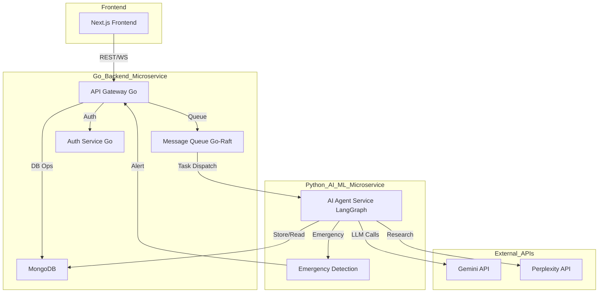

# MedLama - AI-Powered Medical Diagnostics Platform


<p align="center">
  
  
  
  
  
  
  
</p>

**Target Company:** Google Health

## 📋 Table of Contents
* [Core Concept](#-core-concept)
* [System Architecture](#️-system-architecture)
* [Key Features](#-key-features)
* [Technology Stack](#-technology-stack)
* [Engineering Challenges](#-engineering-challenges--solutions)
* [Prerequisites](#-prerequisites)
* [Getting Started](#️-getting-started)
* [Running Tests](#-running-tests)
* [Industry-Aligned Features](#-industry-aligned-features)


## 🌟 Core Concept

MedLama is a cloud-native, microservices-based platform for preliminary medical diagnostics. It combines:
- A high-performance Go backend for API gateway, message queue, and infrastructure
- A Python AI/ML microservice using LangGraph, Gemini, and Perplexity APIs for advanced medical reasoning
- A modern Next.js frontend for seamless user experience

This architecture enables independent team development, robust scalability, and clear separation of concerns. The system is designed for reliability, extensibility, and real-world healthcare impact.

## 🏗️ System Architecture




## 🗂️ Project Folder Layout

The project is organized as three main microservices, each in its own directory for clear separation of concerns and team independence:

```
Full_stack_Medical_Diagnostics/
├── services/
│   ├── backend-service/      # Go backend: API gateway, message queue, auth, DB ops
│   ├── ai-service/           # Python AI/ML: LangGraph agents, LLM integration, research
│   └── frontend/             # Next.js frontend: UI, user flows, API integration
├── deployment/               # Docker Compose, Kubernetes manifests, CI/CD
├── scripts/                  # Utility scripts
└── README.md
```

**Benefits of this layout:**
- Enables Go, Python, and Frontend teams to work independently and in parallel
- Makes it easy to isolate, debug, and deploy each service separately
- Supports scalable, modular development and clear code ownership
- Simplifies onboarding for new contributors by clarifying service boundaries
- Facilitates containerization and cloud-native deployment

---

## 📦 Key Features
- [ ] AI-powered symptom triage and diagnostic reasoning
- [ ] Multi-turn, context-aware conversation state
- [ ] Emergency detection and escalation
- [ ] Real-time notifications and alerts
- [ ] Secure user authentication and data privacy
- [ ] Modern, responsive frontend (Next.js, TypeScript)
- [ ] Efficient storage and retrieval of medical conversations
- [ ] Modular microservices for scalability

## ☁️ Technology Stack
| Category      | Technology                                 | Rationale                                                                 |
|--------------|--------------------------------------------|--------------------------------------------------------------------------|
| Backend Infrastructure | Go, gRPC, Raft Consensus, Docker        | High-performance API gateway, message queue, and infrastructure         |
| AI/ML Service         | Python, FastAPI/Flask, LangGraph, LangChain | Advanced medical reasoning, stateful workflows, LLM integration         |
| LLM APIs              | Gemini API, Perplexity API                | Real-time medical research and diagnostic reasoning                      |
| Frontend              | Next.js, React, TypeScript                | Modern, type-safe, performant UI                                        |
| Database              | MongoDB                                   | Flexible document store for conversation history                        |
| Real-time             | WebSockets                                | Live chat and notifications                                             |
| Container             | Docker                                    | Consistent, portable deployments                                        |
| Orchestration         | Kubernetes (future phases)                | Scalability and resilience                                              |
| Testing               | Pytest, Jest, Cypress                     | Comprehensive backend and frontend testing                              |

## 🧠 Engineering Challenges & Solutions

### Challenge 1: Real-time, Multi-turn Conversation State
**Problem:** Maintaining context and accuracy across complex, multi-step medical dialogues.
**Solution:** Use LangGraph to manage robust conversational state and enable tool-using agent workflows.

### Challenge 2: Emergency Detection & Escalation
**Problem:** Identifying urgent medical cases in real time and triggering appropriate alerts.
**Solution:** Dedicated microservice for emergency detection, with real-time notification integration.

### Challenge 3: Data Privacy & Security
**Problem:** Ensuring sensitive health data is protected and compliant with regulations.
**Solution:** Secure authentication, encrypted storage, and strict access controls throughout the stack.


## 📋 Prerequisites

- Go 1.22+
- Python 3.10+
- Node.js 18+
- MongoDB (local or Atlas)
- `GEMINI_API_KEY` (Google Gemini)
- `PERPLEXITY_API_KEY` (Perplexity)

## 🛠️ Getting Started


### Go Backend Setup
1. Navigate to the Go backend service:
    ```bash
    cd services/backend-service
    ```
2. Install dependencies:
    ```bash
    go mod tidy
    ```
3. Build and run the Go backend:
    ```bash
    go run ./cmd/main.go
    ```

### Python AI/ML Service Setup
1. Navigate to the Python AI/ML service:
    ```bash
    cd services/ai-service
    ```
2. Set up a Python virtual environment:
    ```bash
    python -m venv venv
    source venv/bin/activate  # On Windows: venv\Scripts\activate
    ```
3. Install Python dependencies:
    ```bash
    pip install -r requirements.txt
    ```
4. Set up environment variables:
    - Create a `.env` file in the ai-service directory and add your API keys.
5. Run the AI/ML service:
    ```bash
    python -m api.main
    ```

### Frontend Setup
1. Navigate to the frontend directory:
    ```bash
    cd services/frontend
    ```
2. Install dependencies:
    ```bash
    npm install
    ```
3. Run the frontend:
    ```bash
    npm run dev
    ```


## 🧪 Running Tests

- **Go Backend Tests:**
    ```bash
    cd services/backend-service
    go test ./...
    ```
- **Python AI/ML Service Tests:**
    ```bash
    cd services/ai-service
    pytest
    ```
- **Frontend Tests:**
    ```bash
    cd services/frontend
    npm test
    ```

## 🎯 Industry-Aligned Features
| Focus Area                | Implementation Example                        | Why It Matters                                 |
|---------------------------|-----------------------------------------------|------------------------------------------------|
| Conversational AI         | Multi-turn, context-aware agent               | Simulates real consultations                   |
| Emergency Handling        | Real-time detection & escalation              | Patient safety, critical for healthcare        |
| Data Privacy & Security   | Encrypted storage, secure auth                | Regulatory compliance, user trust              |
| Scalable Microservices    | Modular Go/Python backend, containerized deployment | Handles high concurrency, easy to extend   |
| Modern UX                 | Next.js, responsive design                    | User engagement, accessibility                 |


### Why MedLama Appeals to Google Health
- Demonstrates scalable, AI-driven healthcare solutions
- Focus on patient safety and data privacy
- Modern, modular architecture for rapid innovation
- Real-world engineering challenges and solutions
- Clear separation of Go, Python, and Frontend services for team scalability

---

*Built with ❤️ to organize the world’s healthcare information, making it universally accessible and useful.*
